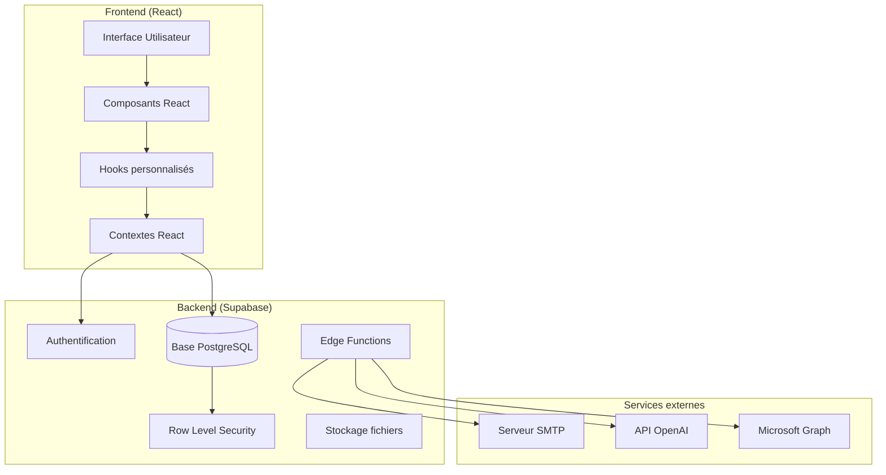
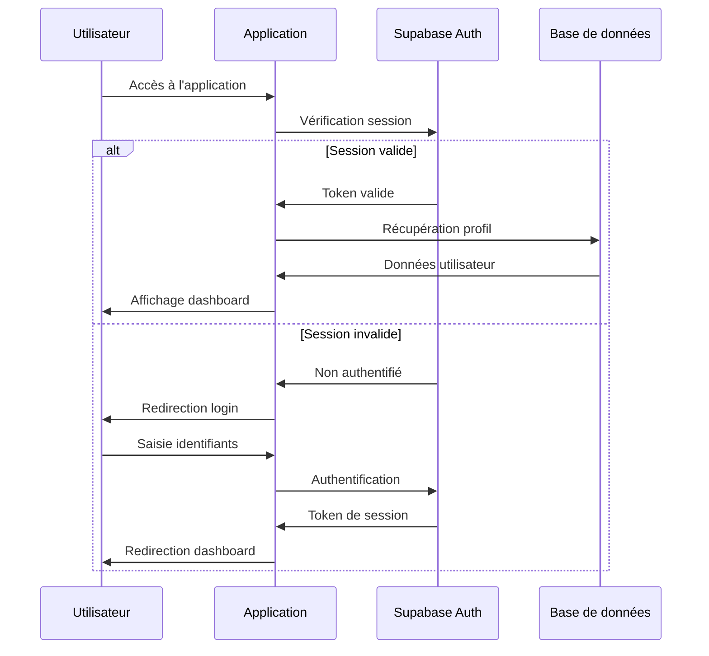
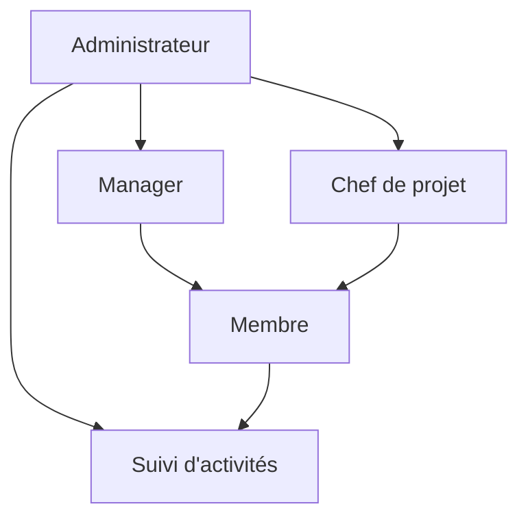
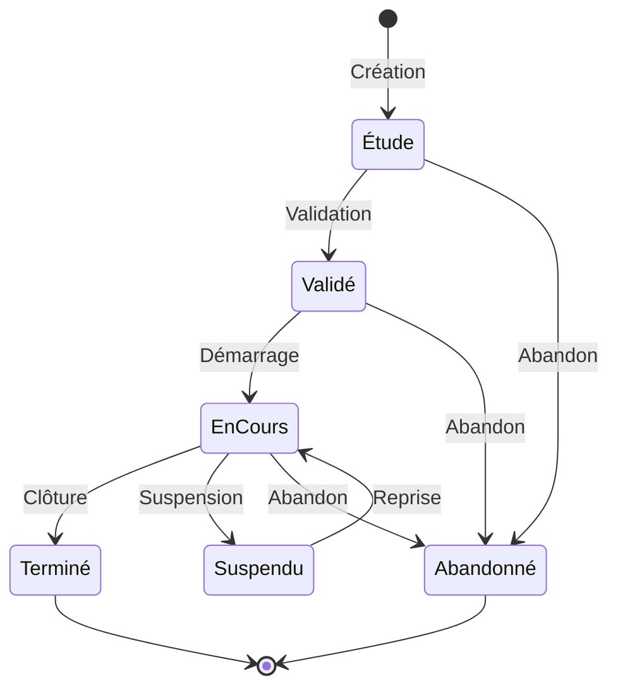
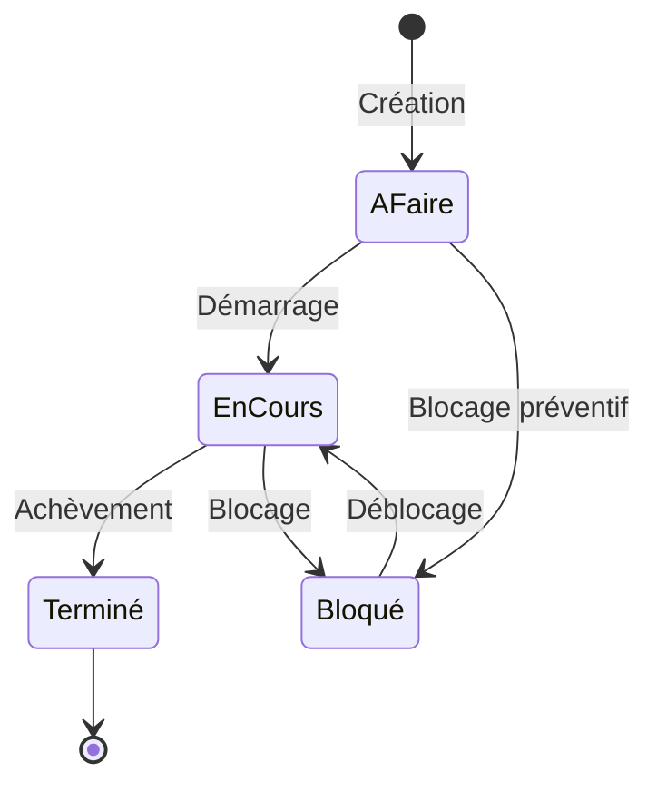
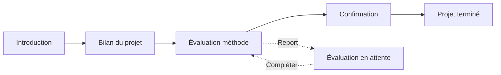
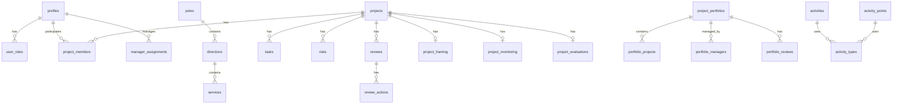

# METEOR - Documentation Complète

**Application de Gestion de Projets Simplifiée**

Version 3.0 | Janvier 2026

---

## Table des matières

1. [Introduction et Présentation](#1-introduction-et-présentation)
2. [Connexion et Authentification](#2-connexion-et-authentification)
3. [Profils et Rôles Utilisateurs](#3-profils-et-rôles-utilisateurs)
4. [Tableau de Bord](#4-tableau-de-bord)
5. [Gestion des Projets](#5-gestion-des-projets)
6. [Gestion des Tâches](#6-gestion-des-tâches)
7. [Gestion des Risques](#7-gestion-des-risques)
8. [Revues de Projet](#8-revues-de-projet)
9. [Clôture et Évaluation des Projets](#9-clôture-et-évaluation-des-projets)
10. [Note de Cadrage](#10-note-de-cadrage)
11. [Équipe Projet](#11-équipe-projet)
12. [Gestion des Portefeuilles de Projet](#12-gestion-des-portefeuilles-de-projet)
13. [Suivi des Activités](#13-suivi-des-activités)
14. [Panier de Projets](#14-panier-de-projets)
15. [Mode Présentation](#15-mode-présentation)
16. [Administration](#16-administration)
17. [API REST](#17-api-rest)
18. [Base de Données](#18-base-de-données)
19. [Edge Functions](#19-edge-functions)
20. [Configuration et Déploiement](#20-configuration-et-déploiement)

---

## 1. Introduction et Présentation

### 1.1 Présentation générale

METEOR est une application web de gestion de projets simplifiée permettant de :

- **Saisir et gérer des projets** avec leurs informations essentielles
- **Suivre l'avancement des tâches** avec vue Kanban et Gantt
- **Établir la liste des risques** et leur plan d'atténuation
- **Réaliser des revues de projet** périodiques
- **Suivre les activités** des utilisateurs (temps ou points)
- **Gérer des portefeuilles de projets** pour une vision consolidée
- **Exporter des données** au format Excel ou PowerPoint

### 1.2 Technologies utilisées

| Technologie | Usage |
|-------------|-------|
| **Vite** | Build tool et serveur de développement |
| **React 18** | Framework frontend |
| **TypeScript** | Langage de programmation typé |
| **Tailwind CSS** | Framework CSS utilitaire |
| **shadcn/ui** | Bibliothèque de composants UI |
| **Supabase** | Backend as a Service (BDD, Auth, Edge Functions) |
| **Tanstack Query** | Gestion du state et cache des requêtes |
| **React Hook Form** | Gestion des formulaires |
| **Recharts** | Graphiques et visualisations |
| **date-fns** | Manipulation des dates |

### 1.3 Architecture de l'application



### 1.4 Structure du projet

```
src/
├── components/          # Composants React réutilisables
│   ├── ui/             # Composants shadcn/ui
│   ├── activities/     # Gestion des activités
│   ├── admin/          # Administration
│   ├── cart/           # Panier de projets
│   ├── form/           # Composants de formulaires
│   ├── framing/        # Note de cadrage
│   ├── gantt/          # Vues Gantt
│   ├── portfolio/      # Portefeuilles
│   ├── project/        # Gestion des projets
│   ├── review/         # Revues de projet
│   ├── risk/           # Gestion des risques
│   └── task/           # Gestion des tâches
├── contexts/           # Contextes React (Permissions)
├── hooks/              # Hooks personnalisés
├── pages/              # Pages de l'application
├── types/              # Définitions TypeScript
├── utils/              # Fonctions utilitaires
└── integrations/       # Intégrations (Supabase)

supabase/
├── functions/          # Edge Functions
└── migrations/         # Migrations SQL
```

---

## 2. Connexion et Authentification

### 2.1 Page de connexion

L'accès à METEOR nécessite une authentification. La page de connexion propose :

- **Connexion par email/mot de passe** : Saisie des identifiants
- **Lien magique** : Réception d'un lien de connexion par email (si configuré)

### 2.2 Création de compte

La création de compte peut se faire de deux manières :

1. **Invitation par un administrateur** : L'utilisateur reçoit un email d'invitation
2. **Auto-inscription** : Si activée dans les paramètres de l'application

### 2.3 Processus d'onboarding

À la première connexion, un tutoriel d'onboarding guide l'utilisateur :

1. **Bienvenue** : Présentation de l'application
2. **Profil** : Complétion des informations personnelles (nom, prénom)
3. **Découverte** : Présentation des fonctionnalités principales

### 2.4 Complétion du profil

Un profil incomplet (sans nom ou prénom) déclenche une boîte de dialogue invitant l'utilisateur à compléter ses informations. Cette étape est nécessaire pour :

- Être identifié correctement dans les projets
- Être assignable comme chef de projet ou membre d'équipe
- Recevoir les notifications personnalisées

### 2.5 Flux d'authentification



---

## 3. Profils et Rôles Utilisateurs

### 3.1 Vue d'ensemble des rôles

METEOR dispose d'un système de rôles hiérarchique permettant de gérer finement les permissions.

| Rôle | Code | Description |
|------|------|-------------|
| Administrateur | `admin` | Accès complet à toutes les fonctionnalités |
| Manager | `manager` | Supervision des projets de son périmètre organisationnel |
| Chef de projet | `chef_projet` | Gestion complète de ses projets |
| Membre | `membre` | Participation aux projets assignés |
| Suivi d'activités | `time_tracker` | Saisie et suivi de ses activités |
| Gestionnaire de portefeuille | - | Gestion des portefeuilles (via `portfolio_managers`) |

### 3.2 Administrateur

**Droits et responsabilités :**

- Accès à toutes les fonctionnalités de l'application
- Gestion des utilisateurs (création, modification, désactivation)
- Gestion de l'organisation (pôles, directions, services)
- Configuration des paramètres de l'application
- Gestion des modèles de projet
- Gestion des types d'activités
- Gestion des tokens API
- Gestion des prompts IA
- Monitoring de l'utilisation de l'IA
- Création et gestion de tous les projets

**Mode administrateur désactivable :**

L'administrateur peut temporairement désactiver son mode admin via un switch dans l'interface. Cela permet de :
- Tester l'expérience utilisateur standard
- Valider les permissions des autres rôles
- Former les utilisateurs

### 3.3 Manager

**Droits et responsabilités :**

- Vision sur les projets de son périmètre organisationnel
- Consultation des projets rattachés à son pôle/direction/service
- Accès en lecture aux revues et indicateurs
- Suivi de l'avancement des projets de son périmètre

**Affectation :**

Le manager est affecté à un ou plusieurs éléments de la hiérarchie organisationnelle :
- Pôle (niveau le plus haut)
- Direction
- Service (niveau le plus fin)

### 3.4 Chef de projet

**Droits et responsabilités :**

- Création de nouveaux projets
- Gestion complète des projets dont il est responsable
- Gestion des tâches (création, modification, suppression)
- Gestion des risques
- Création des revues de projet
- Clôture et évaluation des projets
- Gestion de l'équipe projet
- Export des données du projet

**Types de chef de projet :**

| Type | Description |
|------|-------------|
| Principal | Chef de projet désigné, responsable principal |
| Secondaire | Chef de projet ajouté via l'équipe projet, mêmes droits que le principal |

### 3.5 Membre

**Droits et responsabilités :**

- Consultation des projets auxquels il participe
- Mise à jour des tâches qui lui sont assignées
- Consultation des revues et indicateurs
- Participation aux discussions du projet

### 3.6 Suivi d'activités (Time Tracker)

**Droits et responsabilités :**

- Saisie de ses activités (heures ou points)
- Consultation de son tableau de bord d'activités
- Import d'activités depuis un calendrier externe
- Visualisation de ses statistiques personnelles

### 3.7 Gestionnaire de portefeuille

**Droits et responsabilités :**

- Création et gestion de portefeuilles de projets
- Ajout et retrait de projets dans ses portefeuilles
- Organisation des revues de projets
- Gestion des gestionnaires du portefeuille
- Export des données du portefeuille

**Rôles dans un portefeuille :**

| Rôle | Droits |
|------|--------|
| Propriétaire | Tous les droits (création, modification, suppression, gestion des gestionnaires) |
| Gestionnaire | Ajout/retrait de projets, organisation des revues, export |
| Membre | Consultation uniquement (via appartenance à un projet du portefeuille) |

### 3.8 Hiérarchie des rôles



---

## 4. Tableau de Bord

### 4.1 Présentation

Le tableau de bord est la page d'accueil de l'application après connexion. Il offre une vue synthétique de l'activité et des projets.

### 4.2 Composants du tableau de bord

#### Synthèse des projets

Affiche des compteurs par statut de cycle de vie :
- Projets en étude
- Projets validés
- Projets en cours
- Projets terminés
- Projets suspendus
- Projets abandonnés

#### Section Alertes

Affiche les alertes nécessitant une attention :
- Projets sans revue depuis plus de X jours
- Tâches en retard
- Risques critiques non traités
- Projets en météo "orageuse"

#### Actions rapides

Boutons d'accès rapide aux actions fréquentes :
- Nouveau projet
- Nouvelle revue
- Mes tâches
- Mes activités

#### Projets récents

Liste des derniers projets consultés ou modifiés, permettant un accès rapide.

### 4.3 Filtrage et personnalisation

- **Mes projets uniquement** : Filtre pour n'afficher que les projets dont l'utilisateur est membre
- **Période** : Sélection de la période d'analyse

---

## 5. Gestion des Projets

### 5.1 Liste des projets

La liste des projets propose plusieurs modes d'affichage :

| Mode | Description |
|------|-------------|
| Tableau | Vue tabulaire avec tri et filtrage |
| Grille | Vue en cartes pour une navigation visuelle |
| Kanban | Vue par colonnes selon le cycle de vie |

#### Filtres disponibles

- **Cycle de vie** : Étude, Validé, En cours, Terminé, Suspendu, Abandonné
- **Météo** : Ensoleillé, Nuageux, Orageux
- **Organisation** : Pôle, Direction, Service
- **Suivi DGS** : Projets suivis par la Direction Générale
- **Chef de projet** : Filtrage par responsable
- **Recherche textuelle** : Sur le titre et la description

### 5.2 Création d'un projet

Le formulaire de création de projet se déroule en plusieurs étapes :

#### Étape 1 : Informations générales

| Champ | Description | Obligatoire |
|-------|-------------|-------------|
| Titre | Nom du projet | Oui |
| Description | Description détaillée | Non |
| Date de début | Date prévisionnelle de démarrage | Non |
| Date de fin | Date prévisionnelle de fin | Non |
| Priorité | Basse, Normale, Haute, Critique | Non |

#### Étape 2 : Organisation

| Champ | Description | Obligatoire |
|-------|-------------|-------------|
| Pôle | Pôle de rattachement | Non |
| Direction | Direction de rattachement | Non |
| Service | Service de rattachement | Non |
| Projet pour | Entité bénéficiaire (si différente) | Non |

#### Étape 3 : Responsable

| Champ | Description | Obligatoire |
|-------|-------------|-------------|
| Chef de projet | Utilisateur responsable du projet | Non |
| Suivi DGS | Indicateur de suivi par la Direction Générale | Non |

#### Étape 4 : Options avancées

| Champ | Description |
|-------|-------------|
| Modèle de projet | Application d'un modèle avec tâches prédéfinies |
| Portefeuilles | Rattachement à un ou plusieurs portefeuilles |

### 5.3 Cycle de vie du projet



| Statut | Description | Actions possibles |
|--------|-------------|-------------------|
| Étude | Projet en phase de réflexion | Valider, Abandonner |
| Validé | Projet approuvé, prêt à démarrer | Démarrer, Abandonner |
| En cours | Projet actif | Suspendre, Clôturer, Abandonner |
| Suspendu | Projet temporairement arrêté | Reprendre, Abandonner |
| Terminé | Projet achevé | (État final) |
| Abandonné | Projet annulé | (État final) |

### 5.4 Météo du projet

La météo représente l'état de santé du projet :

| Météo | Icône | Description |
|-------|-------|-------------|
| Ensoleillé | ☀️ | Projet sans difficultés majeures |
| Nuageux | ⛅ | Projet avec des points d'attention |
| Orageux | ⛈️ | Projet en difficulté nécessitant des actions |

### 5.5 Synthèse du projet

La page de synthèse (`/project/:id`) présente :

- **En-tête** : Titre, météo, cycle de vie, chef de projet
- **Indicateurs** : Avancement, nombre de tâches, nombre de risques
- **Dernière revue** : Résumé de la dernière revue effectuée
- **Actions** : Modifier, Nouvelle revue, Clôturer, Exporter

### 5.6 Projets liés

Un projet peut être lié à un projet "maître" pour créer une hiérarchie :

- Le projet lié hérite de certaines informations du projet maître
- La navigation permet de passer facilement entre projets liés
- Un badge indique le lien sur la fiche projet

---

## 6. Gestion des Tâches

### 6.1 Accès aux tâches

Les tâches sont accessibles depuis :
- La page du projet → Onglet "Tâches"
- Le menu principal → "Mes tâches" (tâches assignées à l'utilisateur)

### 6.2 Création d'une tâche

| Champ | Description | Obligatoire |
|-------|-------------|-------------|
| Titre | Nom de la tâche | Oui |
| Description | Détails de la tâche | Non |
| Statut | À faire, En cours, Terminé, Bloqué | Oui |
| Assigné à | Membre de l'équipe responsable | Non |
| Date de début | Date de démarrage prévue | Non |
| Date d'échéance | Date limite | Non |
| Tâche parente | Pour créer une sous-tâche | Non |

### 6.3 Statuts des tâches



| Statut | Code | Description |
|--------|------|-------------|
| À faire | `todo` | Tâche créée, non démarrée |
| En cours | `in_progress` | Tâche en cours de réalisation |
| Terminé | `done` | Tâche achevée |
| Bloqué | `blocked` | Tâche bloquée par un obstacle |

### 6.4 Vues des tâches

#### Vue Tableau

Liste tabulaire avec colonnes triables :
- Titre
- Statut
- Assigné
- Date d'échéance
- Actions

#### Vue Kanban

Colonnes par statut permettant le glisser-déposer pour changer le statut.

#### Vue Gantt

Diagramme temporel affichant :
- Les tâches sur une timeline
- Les dépendances entre tâches
- L'avancement de chaque tâche

### 6.5 Sous-tâches

Une tâche peut contenir des sous-tâches pour une décomposition plus fine. La tâche parente affiche alors :
- Le nombre de sous-tâches
- Le pourcentage de sous-tâches terminées

### 6.6 Mes tâches

La page "Mes tâches" (`/my-tasks`) affiche toutes les tâches assignées à l'utilisateur connecté, tous projets confondus, avec :
- Filtrage par statut
- Filtrage par projet
- Tri par date d'échéance

---

## 7. Gestion des Risques

### 7.1 Accès aux risques

Les risques sont accessibles depuis la page du projet → Onglet "Risques".

### 7.2 Création d'un risque

| Champ | Description | Obligatoire |
|-------|-------------|-------------|
| Titre | Nom du risque | Oui |
| Description | Description détaillée | Non |
| Probabilité | Faible, Moyenne, Élevée | Oui |
| Sévérité | Faible, Moyenne, Élevée, Critique | Oui |
| Statut | Ouvert, En atténuation, Fermé | Oui |
| Plan d'atténuation | Actions prévues pour réduire le risque | Non |

### 7.3 Matrice de criticité

La criticité d'un risque est calculée par le croisement probabilité × sévérité :

|  | Faible | Moyenne | Élevée | Critique |
|--|--------|---------|--------|----------|
| **Élevée** | Modéré | Élevé | Critique | Critique |
| **Moyenne** | Faible | Modéré | Élevé | Critique |
| **Faible** | Faible | Faible | Modéré | Élevé |

### 7.4 Statuts des risques

| Statut | Code | Description |
|--------|------|-------------|
| Ouvert | `open` | Risque identifié, non traité |
| En atténuation | `in_mitigation` | Actions en cours pour réduire le risque |
| Fermé | `closed` | Risque résolu ou non pertinent |

### 7.5 Synthèse des risques

Sur la page du projet, un résumé des risques affiche :
- Nombre de risques par statut
- Nombre de risques par niveau de criticité
- Indicateur visuel si risques critiques présents

---

## 8. Revues de Projet

### 8.1 Présentation

Les revues de projet permettent de documenter l'état d'avancement à un instant T et de créer un historique du projet.

### 8.2 Création d'une revue

La création d'une revue s'effectue depuis :
- La page de synthèse du projet → Bouton "Nouvelle revue"
- Le tableau de bord → Action rapide "Nouvelle revue"

### 8.3 Contenu d'une revue

| Champ | Description |
|-------|-------------|
| Météo | État de santé du projet (Ensoleillé, Nuageux, Orageux) |
| Évolution | Tendance par rapport à la dernière revue (En amélioration, Stable, En dégradation) |
| Avancement | Pourcentage de complétion (0-100%) |
| Commentaire | Description de l'état actuel du projet |
| Difficultés | Points bloquants ou problématiques rencontrées |
| Actions | Liste des actions correctives prévues |

### 8.4 Historique des revues

L'historique des revues est accessible depuis l'onglet "Revues" du projet. Il affiche :
- Date de chaque revue
- Météo et évolution
- Avancement
- Commentaires

### 8.5 Impact d'une revue

La création d'une revue met à jour automatiquement :
- La météo du projet
- L'indicateur d'évolution
- La date de dernière revue

---

## 9. Clôture et Évaluation des Projets

### 9.1 Présentation

La clôture d'un projet est un processus structuré en plusieurs étapes qui remplace le passage direct au statut "Terminé". Ce processus permet de :

- Formaliser la fin du projet avec un bilan final
- Évaluer la méthodologie et les pratiques utilisées
- Capitaliser sur les retours d'expérience

### 9.2 Accès à la clôture

Le bouton "Clôturer le projet" est disponible :
- Sur la page de synthèse du projet
- Uniquement pour les chefs de projet (principal ou secondaire)
- Si le projet n'est pas déjà au statut "Terminé"

### 9.3 Processus de clôture



### 9.4 Étape 1 : Introduction

Présentation du processus de clôture et de ses objectifs :
- Explication des étapes à venir
- Importance de la capitalisation
- Possibilité de reporter l'évaluation

### 9.5 Étape 2 : Bilan du projet (Niveau 1)

**Objectif** : Documenter l'état final du projet.

| Champ | Description |
|-------|-------------|
| Météo finale | État général du projet à sa conclusion |
| Évolution | Tendance par rapport à la dernière revue |
| Avancement | Fixé à 100% pour un projet terminé |
| Commentaire de clôture | Synthèse finale du projet |

Cette étape crée une revue finale marquée comme `is_final_review`.

### 9.6 Étape 3 : Évaluation de la méthode (Niveau 2)

**Objectif** : Évaluer les pratiques méthodologiques pour capitalisation.

#### Évaluations quantitatives (1 à 5)

| Critère | Description |
|---------|-------------|
| Planification | Qualité de la planification initiale |
| Communication | Efficacité de la communication dans l'équipe |
| Gestion des risques | Pertinence de l'identification et du traitement |
| Atteinte des objectifs | Niveau d'atteinte des objectifs initiaux |

#### Évaluations qualitatives

| Champ | Description |
|-------|-------------|
| Ce qui a bien fonctionné | Points forts du projet |
| Ce qui a manqué | Éléments qui auraient pu améliorer le projet |
| Améliorations proposées | Axes d'amélioration pour les futurs projets |
| Leçons apprises | Enseignements à retenir |

#### Option de report

Si le chef de projet ne peut pas compléter l'évaluation immédiatement, il peut la reporter. Le projet passe alors en statut "Évaluation en attente".

### 9.7 Étape 4 : Confirmation

Récapitulatif des informations saisies et validation finale de la clôture.

### 9.8 Évaluation en attente

Lorsqu'une évaluation a été reportée :
- Un badge orange "Évaluation en attente" s'affiche sur la fiche projet
- Un bouton "Compléter l'évaluation" permet de finaliser le processus
- Le projet est au statut "Terminé" mais l'évaluation reste à compléter

### 9.9 État après clôture

Une fois le projet clôturé :
- Le statut passe à "Terminé"
- La dernière revue est marquée comme "revue finale"
- Les évaluations sont enregistrées dans `project_evaluations`
- Le projet reste consultable mais n'est plus modifiable

---

## 10. Note de Cadrage

### 10.1 Présentation

La note de cadrage est un document structuré qui définit le périmètre et les objectifs d'un projet. Elle est accessible depuis la page du projet → Onglet "Cadrage".

### 10.2 Sections de la note de cadrage

| Section | Description |
|---------|-------------|
| Contexte | Situation actuelle et raisons du projet |
| Parties prenantes | Acteurs impliqués et leurs rôles |
| Gouvernance | Organisation et processus de décision |
| Objectifs | Résultats attendus du projet |
| Calendrier | Planning prévisionnel |
| Livrables | Produits et résultats concrets |

### 10.3 Édition du contenu

Chaque section peut être éditée individuellement avec :
- Un éditeur de texte enrichi
- Support du format Markdown
- Sauvegarde automatique

### 10.4 Génération assistée par IA

Si configurée, l'IA peut générer automatiquement le contenu de chaque section à partir :
- Du titre du projet
- De la description du projet
- Des informations existantes

**Prérequis** :
- Configuration de la clé API OpenAI dans les paramètres
- Activation des prompts IA dans l'administration

### 10.5 Export DOCX

La note de cadrage peut être exportée au format Word (DOCX) avec :
- Mise en forme professionnelle
- En-tête avec le nom du projet
- Table des matières
- Toutes les sections remplies

---

## 11. Équipe Projet

### 11.1 Accès

La gestion de l'équipe est accessible depuis la page du projet → Onglet "Équipe" ou via le menu "Équipe" du projet.

### 11.2 Rôles dans l'équipe

| Rôle | Description | Droits |
|------|-------------|--------|
| Chef de projet principal | Responsable désigné du projet | Tous les droits |
| Chef de projet secondaire | Co-responsable du projet | Mêmes droits que le principal |
| Membre | Participant au projet | Lecture et mise à jour des tâches assignées |

### 11.3 Ajout de membres

Pour ajouter un membre à l'équipe :
1. Cliquer sur "Ajouter un membre"
2. Sélectionner l'utilisateur dans la liste
3. Choisir son rôle (Chef de projet secondaire ou Membre)
4. Valider l'ajout

### 11.4 Invitation de nouveaux utilisateurs

Si l'utilisateur n'existe pas encore :
1. Cliquer sur "Inviter un utilisateur"
2. Saisir l'adresse email
3. Choisir le rôle dans l'équipe
4. Un email d'invitation est envoyé

### 11.5 Modification et suppression

- Le rôle d'un membre peut être modifié à tout moment
- Un membre peut être retiré de l'équipe
- Le chef de projet principal ne peut pas être supprimé de l'équipe

---

## 12. Gestion des Portefeuilles de Projet

### 12.1 Présentation

Un portefeuille de projet permet de regrouper plusieurs projets partageant des objectifs stratégiques communs. Cette fonctionnalité permet de :

- Avoir une vision consolidée de l'avancement de plusieurs projets
- Définir des objectifs stratégiques et un budget global
- Organiser des revues de projets périodiques
- Exporter des synthèses au format Excel ou PowerPoint

### 12.2 Accès aux portefeuilles

Les portefeuilles sont accessibles via :
- Le menu principal → "Portefeuilles"
- Le tableau de bord → Section "Mes portefeuilles" (si applicable)

### 12.3 Création d'un portefeuille

| Champ | Description | Obligatoire |
|-------|-------------|-------------|
| Nom | Nom du portefeuille | Oui |
| Description | Description du portefeuille | Non |
| Objectifs stratégiques | Objectifs communs aux projets | Non |
| Budget total | Enveloppe budgétaire globale | Non |
| Date de début | Date de début du portefeuille | Non |
| Date de fin | Date de fin prévue | Non |
| Statut | Actif, Suspendu, Terminé | Oui |

### 12.4 Page de détails d'un portefeuille

La page de détails (`/portfolio/:id`) présente 4 onglets :

#### Onglet Vue d'ensemble

- Informations générales du portefeuille
- Graphique de répartition par météo
- Graphique de répartition par cycle de vie
- Indicateur d'avancement moyen

#### Onglet Projets

- Liste des projets du portefeuille
- Bouton "Ajouter des projets"
- Possibilité de retirer un projet
- Tri et filtrage

#### Onglet Revues de projets

- Liste des revues organisées
- Bouton "Organiser les revues"
- État d'avancement des revues demandées
- Historique des notifications envoyées

#### Onglet Gestionnaires

- Liste des gestionnaires du portefeuille
- Rôle de chaque gestionnaire
- Bouton "Ajouter un gestionnaire"
- Modification/suppression des gestionnaires

### 12.5 Organisation des revues

La fonctionnalité "Organiser les revues" permet de :

1. **Définir une revue** : Titre, date d'échéance, notes
2. **Sélectionner les projets** : Choisir les projets concernés
3. **Notifier les chefs de projet** : Envoi d'emails personnalisés
4. **Suivre l'avancement** : Visualisation des revues effectuées

### 12.6 Rôles et permissions

| Rôle | Voir | Ajouter projets | Organiser revues | Gérer gestionnaires | Supprimer |
|------|------|-----------------|------------------|---------------------|-----------|
| Propriétaire | ✅ | ✅ | ✅ | ✅ | ✅ |
| Gestionnaire | ✅ | ✅ | ✅ | ❌ | ❌ |
| Membre | ✅ | ❌ | ❌ | ❌ | ❌ |

### 12.7 Export du portefeuille

Deux formats d'export sont disponibles :

#### Export Excel

Génère un fichier XLSX contenant :
- Informations du portefeuille
- Liste des projets avec indicateurs
- Statistiques agrégées

#### Export PowerPoint

Génère une présentation PPTX contenant :
- Slide de titre du portefeuille
- Slide de synthèse globale
- Une slide par projet avec indicateurs
- Graphiques de répartition

### 12.8 Vue Gantt du portefeuille

Une vue Gantt permet de visualiser :
- Les projets du portefeuille sur une timeline
- Les dates de début et fin de chaque projet
- L'état d'avancement visuel

---

## 13. Suivi des Activités

### 13.1 Présentation

Le module de suivi des activités permet aux utilisateurs de documenter leur temps de travail, soit en heures, soit en points.

### 13.2 Accès

- Menu principal → "Mes activités"
- Accessible aux utilisateurs ayant le rôle `time_tracker`

### 13.3 Modes de saisie

#### Mode Heures

Saisie classique du temps passé :
- Date et heure de début
- Durée en minutes
- Type d'activité
- Projet associé (optionnel)
- Description

#### Mode Points

Saisie simplifiée par points :
- Semaine concernée
- Points par jour (ex: 0, 0.25, 0.5, 0.75, 1)
- Type d'activité
- Projet associé (optionnel)

### 13.4 Types d'activités

Les types d'activités sont configurables par l'administrateur :

| Champ | Description |
|-------|-------------|
| Code | Identifiant unique |
| Libellé | Nom affiché |
| Couleur | Couleur de représentation |
| Ordre d'affichage | Position dans les listes |
| Actif | Disponibilité du type |

### 13.5 Tableau de bord individuel

Le tableau de bord d'activités présente :
- Saisie rapide de la semaine en cours
- Graphique de répartition par type d'activité
- Graphique de répartition par projet
- Historique des saisies

### 13.6 Import depuis calendrier

L'import depuis calendrier Microsoft permet de :
1. Se connecter avec son compte Microsoft
2. Sélectionner une période
3. Visualiser les événements du calendrier
4. Associer chaque événement à un type d'activité
5. Importer en masse

### 13.7 Quotas et objectifs

L'administrateur peut définir :
- Un quota de points par semaine
- Un objectif d'heures par période
- Des alertes en cas de sous-saisie

### 13.8 Tableau de bord équipe

Les managers peuvent accéder à une vue consolidée de leur équipe :
- Saisies par utilisateur
- Répartition par type d'activité
- Comparaison aux objectifs

---

## 14. Panier de Projets

### 14.1 Présentation

Le panier de projets permet de sélectionner temporairement des projets pour réaliser des exports groupés.

### 14.2 Ajout au panier

Les projets peuvent être ajoutés au panier depuis :
- La liste des projets → Bouton "Ajouter au panier"
- La page de synthèse d'un projet
- En masse via le bouton "Ajouter les projets filtrés"

### 14.3 Gestion du panier

Le panier est accessible via l'icône en haut de page. Il affiche :
- La liste des projets sélectionnés
- Le nombre de projets
- Les options d'export

### 14.4 Options d'export

#### Export Excel

Génère un fichier XLSX contenant :
- Une ligne par projet
- Toutes les informations clés
- La dernière revue

#### Export PowerPoint

Génère une présentation PPTX avec :
- Une slide de titre
- Une slide par projet
- Indicateurs visuels (météo, avancement)

#### Vue Gantt

Affiche un diagramme de Gantt des projets du panier pour visualiser :
- Les périodes de chaque projet
- Les chevauchements
- L'état d'avancement

### 14.5 Persistance

Le panier est :
- Stocké en local (localStorage)
- Conservé entre les sessions
- Vidé manuellement par l'utilisateur

---

## 15. Mode Présentation

### 15.1 Présentation

Le mode présentation permet d'afficher les revues de projet dans un format adapté à la projection lors de réunions.

### 15.2 Accès

- Page de synthèse du projet → Bouton "Présentation"
- URL directe : `/project/:id/presentation`

### 15.3 Navigation

La présentation propose :
- Navigation par flèches gauche/droite
- Raccourcis clavier (←, →)
- Indicateur de progression

### 15.4 Contenu des slides

1. **Slide de titre** : Nom du projet, dates, responsable
2. **Slide de synthèse** : Météo, avancement, indicateurs clés
3. **Slides de revues** : Une slide par revue avec détails
4. **Slide de risques** : Synthèse des risques (si présents)

### 15.5 Personnalisation

- Possibilité de sélectionner les revues à présenter
- Affichage des détails au clic
- Export possible en PDF (via impression du navigateur)

---

## 16. Administration

### 16.1 Accès

L'administration est accessible via le menu utilisateur → "Administration" (réservé aux administrateurs).

### 16.2 Gestion des utilisateurs

#### Liste des utilisateurs

Affiche tous les utilisateurs avec :
- Nom, prénom, email
- Rôles attribués
- Date de création
- Dernière connexion

#### Création d'un utilisateur

| Champ | Description |
|-------|-------------|
| Email | Adresse email (identifiant) |
| Prénom | Prénom de l'utilisateur |
| Nom | Nom de famille |
| Rôles | Rôles à attribuer |

#### Invitation

L'invitation envoie un email avec un lien de création de mot de passe.

### 16.3 Gestion de l'organisation

#### Pôles

Niveau le plus haut de la hiérarchie organisationnelle.

#### Directions

Rattachées à un pôle, représentent les directions de l'organisation.

#### Services

Niveau le plus fin, rattachés à une direction.

### 16.4 Modèles de projet

Les modèles de projet permettent de :
- Définir des structures de tâches réutilisables
- Accélérer la création de nouveaux projets
- Standardiser les processus

#### Création d'un modèle

1. Définir le titre et la description
2. Ajouter des tâches avec leur durée estimée
3. Organiser les tâches (ordre, sous-tâches)
4. Activer le modèle

### 16.5 Types d'activités

Configuration des types d'activités pour le suivi du temps :

| Action | Description |
|--------|-------------|
| Créer | Ajouter un nouveau type |
| Modifier | Changer le libellé, la couleur |
| Désactiver | Masquer sans supprimer |
| Réordonner | Modifier l'ordre d'affichage |

### 16.6 Paramètres de points d'activité

Configuration du système de points :
- Quota hebdomadaire
- Valeur des points
- Alertes de saisie

### 16.7 Gestion des notifications

Création et gestion des notifications système :
- Notifications d'information
- Notifications d'alerte
- Notifications obligatoires (acquittement requis)

### 16.8 Modèles d'emails

Personnalisation des emails envoyés par l'application :
- Invitation utilisateur
- Notification de revue
- Rappel de saisie d'activité

### 16.9 Tokens API

Gestion des tokens pour l'accès API :
- Création de tokens
- Définition des scopes (permissions)
- Révocation
- Logs d'utilisation

### 16.10 Prompts IA

Configuration des prompts pour la génération IA :
- Prompts par section de note de cadrage
- Prompts d'amélioration
- Activation/désactivation

### 16.11 Monitoring IA

Suivi de l'utilisation de l'IA :
- Nombre de requêtes
- Coût estimé
- Historique des générations

### 16.12 Paramètres généraux

| Paramètre | Description |
|-----------|-------------|
| Nom de l'application | Personnalisation du titre |
| Logo | Image de l'application |
| Couleur principale | Thème de l'interface |
| Configuration SMTP | Paramètres d'envoi d'emails |
| Clé API OpenAI | Pour les fonctionnalités IA |
| Configuration Microsoft | Pour l'import calendrier |

---

## 17. API REST

### 17.1 Présentation

METEOR expose une API REST permettant l'intégration avec des systèmes externes.

### 17.2 URL de base

```
https://[SUPABASE_URL]/functions/v1/api-gateway
```

### 17.3 Authentification

Toutes les requêtes doivent inclure un token d'API :

```http
X-API-Key: votre_token_api
```

ou

```http
Authorization: Bearer votre_token_api
```

### 17.4 Endpoints disponibles

#### Projets

| Méthode | Endpoint | Description |
|---------|----------|-------------|
| GET | `/api/projects` | Liste des projets |
| GET | `/api/projects/{id}` | Détails d'un projet |
| GET | `/api/projects/{id}/team` | Équipe du projet |
| GET | `/api/projects/{id}/tasks` | Tâches du projet |
| GET | `/api/projects/{id}/risks` | Risques du projet |

#### Paramètres de filtrage (GET /api/projects)

| Paramètre | Type | Description |
|-----------|------|-------------|
| status | string | Filtrer par météo (sunny, cloudy, stormy) |
| lifecycle_status | string | Filtrer par cycle de vie |
| ids | string | IDs séparés par virgules |
| search | string | Recherche textuelle |
| suivi_dgs | boolean | Projets suivis DGS |
| page | number | Numéro de page |
| limit | number | Éléments par page (max 100) |

### 17.5 Codes de réponse

| Code | Description |
|------|-------------|
| 200 | Succès |
| 400 | Requête invalide |
| 401 | Non authentifié |
| 403 | Accès refusé |
| 404 | Ressource non trouvée |
| 500 | Erreur serveur |

### 17.6 Exemple de réponse

```json
{
  "success": true,
  "data": {
    "items": [...],
    "total": 42,
    "page": 1,
    "limit": 10
  }
}
```

### 17.7 Exemples de requêtes

#### cURL

```bash
curl -X GET \
  "https://[URL]/functions/v1/api-gateway/api/projects" \
  -H "X-API-Key: votre_token"
```

#### Python

```python
import requests

headers = {"X-API-Key": "votre_token"}
response = requests.get(
    "https://[URL]/functions/v1/api-gateway/api/projects",
    headers=headers
)
data = response.json()
```

#### JavaScript

```javascript
const response = await fetch(
  "https://[URL]/functions/v1/api-gateway/api/projects",
  {
    headers: { "X-API-Key": "votre_token" }
  }
);
const data = await response.json();
```

### 17.8 Scopes

Les tokens peuvent être limités par scopes :

| Scope | Accès |
|-------|-------|
| projects:read | Lecture des projets |
| team:read | Lecture des équipes |
| tasks:read | Lecture des tâches |
| risks:read | Lecture des risques |

---

## 18. Base de Données

### 18.1 Schéma général



### 18.2 Tables principales

#### profiles

Informations des utilisateurs.

| Colonne | Type | Description |
|---------|------|-------------|
| id | uuid | Identifiant (lié à auth.users) |
| email | text | Adresse email |
| first_name | text | Prénom |
| last_name | text | Nom |
| created_at | timestamp | Date de création |

#### user_roles

Rôles des utilisateurs.

| Colonne | Type | Description |
|---------|------|-------------|
| id | uuid | Identifiant |
| user_id | uuid | Référence au profil |
| role | text | Rôle (admin, manager, chef_projet, membre, time_tracker) |

#### projects

Projets.

| Colonne | Type | Description |
|---------|------|-------------|
| id | uuid | Identifiant |
| title | text | Titre |
| description | text | Description |
| status | enum | Météo (sunny, cloudy, stormy) |
| lifecycle_status | enum | Cycle de vie |
| progress | enum | Évolution |
| project_manager_id | uuid | Chef de projet |
| pole_id | uuid | Pôle |
| direction_id | uuid | Direction |
| service_id | uuid | Service |
| start_date | date | Date de début |
| end_date | date | Date de fin |
| suivi_dgs | boolean | Suivi DGS |
| closure_status | text | État de clôture |
| created_at | timestamp | Date de création |

#### tasks

Tâches des projets.

| Colonne | Type | Description |
|---------|------|-------------|
| id | uuid | Identifiant |
| project_id | uuid | Projet parent |
| title | text | Titre |
| description | text | Description |
| status | enum | Statut (todo, in_progress, done, blocked) |
| assigned_to | uuid | Utilisateur assigné |
| due_date | date | Date d'échéance |
| parent_task_id | uuid | Tâche parente |

#### risks

Risques des projets.

| Colonne | Type | Description |
|---------|------|-------------|
| id | uuid | Identifiant |
| project_id | uuid | Projet parent |
| title | text | Titre |
| description | text | Description |
| probability | enum | Probabilité |
| severity | enum | Sévérité |
| status | enum | Statut |
| mitigation_plan | text | Plan d'atténuation |

#### reviews

Revues de projet.

| Colonne | Type | Description |
|---------|------|-------------|
| id | uuid | Identifiant |
| project_id | uuid | Projet |
| weather | enum | Météo |
| progress | enum | Évolution |
| completion | integer | Avancement (%) |
| comment | text | Commentaire |
| difficulties | text | Difficultés |
| is_final_review | boolean | Revue finale |
| created_at | timestamp | Date |

#### project_portfolios

Portefeuilles de projets.

| Colonne | Type | Description |
|---------|------|-------------|
| id | uuid | Identifiant |
| name | text | Nom |
| description | text | Description |
| created_by | uuid | Créateur |
| strategic_objectives | text | Objectifs |
| budget_total | numeric | Budget |
| status | text | Statut |

### 18.3 Sécurité (RLS)

Toutes les tables sont protégées par Row Level Security (RLS) :

- **Lecture** : Basée sur les rôles et l'appartenance aux projets
- **Écriture** : Limitée aux propriétaires et administrateurs
- **Suppression** : Généralement réservée aux administrateurs

Exemple de politique RLS :

```sql
-- Les utilisateurs peuvent voir les projets dont ils sont membres
CREATE POLICY "Users can view their projects"
ON projects FOR SELECT
USING (
  auth.uid() IN (
    SELECT user_id FROM project_members WHERE project_id = id
  )
  OR is_admin()
);
```

---

## 19. Edge Functions

### 19.1 Liste des fonctions

| Fonction | Description |
|----------|-------------|
| `api-gateway` | Point d'entrée de l'API REST |
| `ai-assistant` | Assistant IA pour la génération de contenu |
| `invite-user` | Envoi des emails d'invitation |
| `send-email-digest` | Envoi des résumés par email |
| `send-portfolio-review-email` | Notifications de revue de portefeuille |
| `send-test-email` | Test de configuration SMTP |
| `fetch-ms-calendar` | Récupération du calendrier Microsoft |
| `fetch-ics-calendar` | Récupération de calendrier ICS |
| `test-openai-connection` | Test de connexion OpenAI |

### 19.2 api-gateway

Point d'entrée unique pour l'API REST externe.

**Fonctionnalités** :
- Authentification par token
- Routage des requêtes
- Validation des scopes
- Logging des accès

### 19.3 ai-assistant

Génération de contenu par IA.

**Utilisations** :
- Génération de notes de cadrage
- Amélioration de textes
- Suggestions de contenu

**Configuration requise** :
- Clé API OpenAI dans les paramètres

### 19.4 invite-user

Envoi des emails d'invitation aux nouveaux utilisateurs.

**Fonctionnalités** :
- Création du compte utilisateur
- Envoi de l'email avec lien de connexion
- Personnalisation du message

### 19.5 fetch-ms-calendar

Récupération des événements du calendrier Microsoft.

**Prérequis** :
- Configuration Azure AD (Client ID, Tenant ID)
- Authentification de l'utilisateur

---

## 20. Configuration et Déploiement

### 20.1 Variables d'environnement

| Variable | Description | Obligatoire |
|----------|-------------|-------------|
| `VITE_SUPABASE_URL` | URL du projet Supabase | Oui |
| `VITE_SUPABASE_ANON_KEY` | Clé anonyme Supabase | Oui |

### 20.2 Configuration SMTP

Pour l'envoi d'emails, configurer dans Supabase :

1. Aller dans Settings → Auth
2. Configurer le serveur SMTP
3. Définir l'expéditeur par défaut

Configuration dans `application_settings` :

| Clé | Description |
|-----|-------------|
| `smtp_host` | Serveur SMTP |
| `smtp_port` | Port (587 ou 465) |
| `smtp_user` | Utilisateur |
| `smtp_password` | Mot de passe |
| `smtp_from` | Adresse d'expédition |

### 20.3 Configuration Microsoft Graph

Pour l'import de calendrier :

| Clé | Description |
|-----|-------------|
| `microsoft_client_id` | ID d'application Azure |
| `microsoft_tenant_id` | ID du tenant Azure |

### 20.4 Configuration OpenAI

Pour les fonctionnalités IA :

| Clé | Description |
|-----|-------------|
| `openai_api_key` | Clé API OpenAI |

### 20.5 Déploiement Docker

#### Dockerfile

```dockerfile
FROM node:20-alpine as build
WORKDIR /app
COPY package*.json ./
RUN npm ci
COPY . .
RUN npm run build

FROM nginx:alpine
COPY --from=build /app/dist /usr/share/nginx/html
COPY nginx.conf /etc/nginx/conf.d/default.conf
EXPOSE 80
CMD ["nginx", "-g", "daemon off;"]
```

#### docker-compose.yml

```yaml
version: '3.8'
services:
  meteor:
    build: .
    ports:
      - "80:80"
    environment:
      - VITE_SUPABASE_URL=${SUPABASE_URL}
      - VITE_SUPABASE_ANON_KEY=${SUPABASE_ANON_KEY}
```

#### Commandes

```bash
# Construction de l'image
docker build -t meteor:latest .

# Démarrage du conteneur
docker run -d -p 80:80 meteor:latest
```

### 20.6 Auto-hébergement

Pour un déploiement on-premise :

1. **Supabase Self-hosted** : Installer Supabase localement
2. **Configurer les variables** : Pointer vers l'instance locale
3. **Build de l'application** : `npm run build`
4. **Servir les fichiers** : Via Nginx ou autre serveur web

### 20.7 Mise à jour

1. Récupérer les dernières modifications
2. Exécuter les migrations Supabase
3. Rebuilder l'application
4. Redéployer

```bash
# Mise à jour du code
git pull origin main

# Migrations Supabase
supabase db push

# Rebuild
npm run build

# Redéploiement Docker
docker-compose up -d --build
```

---

## Annexes

### A. Glossaire

| Terme | Définition |
|-------|------------|
| CDP | Chef de projet |
| DGS | Direction Générale des Services |
| Météo | Indicateur visuel de l'état du projet |
| RLS | Row Level Security (Supabase) |
| Edge Function | Fonction serverless Supabase |

### B. Raccourcis clavier

| Raccourci | Action |
|-----------|--------|
| `←` / `→` | Navigation en mode présentation |
| `Ctrl+S` | Sauvegarde (formulaires) |
| `Escape` | Fermer les modales |

### C. Limites techniques

| Élément | Limite |
|---------|--------|
| Requêtes API par token | 1000/heure |
| Taille réponse API | 10 Mo |
| Timeout API | 30 secondes |
| Projets par portefeuille | Illimité |
| Membres par projet | Illimité |

### D. Support

Pour toute question ou assistance :
- Documentation en ligne
- Tickets de support via l'administrateur
- Bouton "Feedback" dans l'application

---

*Documentation générée le 09/01/2026*
*Version 3.0 de METEOR*
